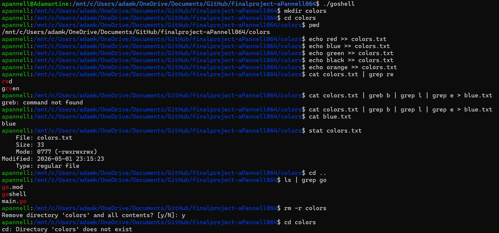

# Go-Psuedoterminal
## Adam Pannell
## Project Report
### Design Overview: 
One of the first things that happens when the program is executed is the registration of commands. All commands are registered in a map from the command string to an commandFunc. This map is a part of the dispatcher struct, which is how commands are actually run. The command function is the actual function that runs when the command string is typed into the terminal. For a command to be executed, it must be in the command map. 

For the commands to be dispatched, they must first be parsed. The strings are tokenized by space, quotes, pipes, and output redirection symbols. After this, all commands are treated as pipelines. After the args are passed to the StagePipeline() function, stdout is determined by the Redirect() function, which redirects to files after  “>” and “>>” operators. The last file in a chain of redirections becomes the final stdout. Os.Stdout is used if the pipeline is not redirected. The StagePipeline() function splits arguments into stages by the pipe operators. If all the commands exist then the pipeline can be ran with the runPipeline() function. 

The runPipeline() function runs goroutines for each stage of the pipeline. Each of these goroutines call the dispatcher’s Dispatch() method. The output of each stage is piped into the next stage’s input. The first stage’s input is usually os.Stdin and the last stage’s output is whatever stdout that was returned in the Redirect() function. Additionally, all commands have their pipes closed to prevent blocking. There is an additional goroutine in charge of waiting for a wait group. The main goroutine takes monitors an error channel. The first error returned gets outputted to stderr. The cd command is explicitly handled differently from other commands. Because it can’t chang state in a pipeline, it is essentially skipped if it is in in the pipeline and the number of stages is greater than 1. 

Finally, shell state is managed by using a state interface that the shell implements. All commands that use or change shell values are written as closures that take in a state instance and return a CommandFunc. For example, cd uses this to set the new working directory for the shell. History uses this to get the history array from the shell instance. 
### Known Limitations: 
With  extensive testing, I was unable to find anything that didn't work, but bugs may be inevitable. Additionally, there are some things that maybe could have been implemented that weren't. For example, Unix has many more commands than what has been implemented. I could also implement input parsing for escape characters.
### Build & Run: 
The project has been compiled into the goshell executable, which can be ran in a linux terminal with ./goshell. 

### Sample Session: 
Below is an image that shows a sample session. 

